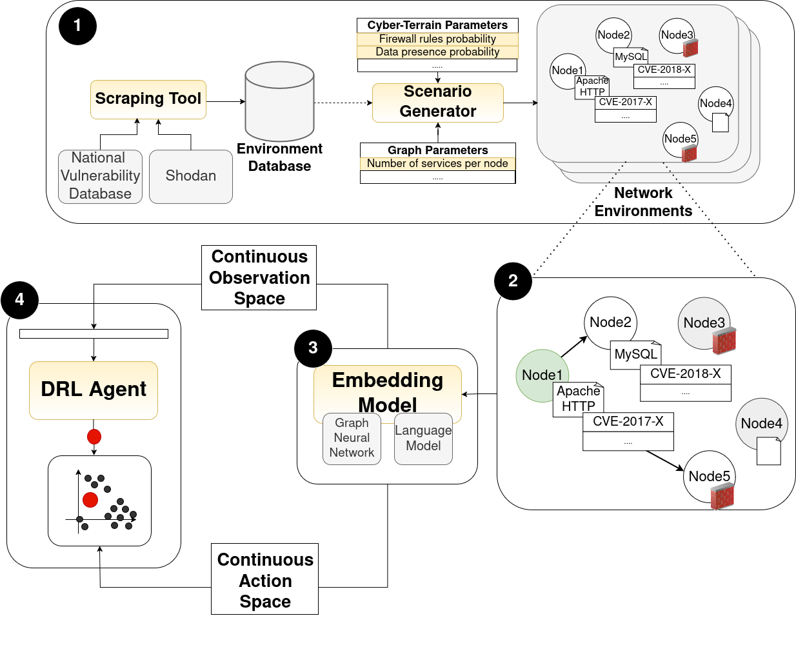

# Continuous CyberBattleSim (C-CyberBattleSim)

[](https://gitlab.inria.fr/resist/C-CyberBattleSim)
[](https://c-cyberbattlesim.readthedocs.io/en/latest/index.html)
[](https://theses.fr/s371241)
[](https://opensource.org/licenses/MIT)
[](https://bil.inria.fr/fr/software/view/5506/tab)
[](https://github.com/microsoft/CyberBattleSim)
[](https://doi.org/10.5281/zenodo.14604651)

<div align="center">
  
  
  
  
</div>
<br>

This repository contains a modification of [Microsoft CyberBattleSim](https://github.com/microsoft/CyberBattleSim), an experimentation research platform to investigate the interaction
of automated agents operating within simulated network environment scenarios for the prediction of attack paths.


This project implements the advancements and extensions described in the paper:
> ##### 📄 Paper Reference
> Franco Terranova, Abdelkader Lahmadi, Isabelle Chrisment. Scalable and Generalizable RL Agents for Attack Path Discovery via Continuous Invariant Spaces. _The 28th International Symposium on Research in Attacks, Intrusions and Defenses (RAID 2025)_.




The main advancements are the following:

1. **Automated Scenario Generation**: Utilizes data from Shodan and the NVD to extract real-world service distributions and vulnerabilities, generating diverse synthetic scenarios through domain randomization with configurable parameters.
2. **Game Reformulation**: Enhances the attack environment modeling by reformulating it as a POMDP by incorporating richer features and transitions.
3. **World Model Learning**: Employs Graph Neural Networks and Language Models to encode graph structures and vulnerability information into continuous latent embedding spaces.
4. **Invariant Agent Architecture**: Redesigns observation and action spaces using the learned latent representations to ensure independence from specific topologies or vulnerability sets, enabling more scalable and generalizable RL agents.

The rest of this README offers a quick overview of usage. For complete details and in-depth information, please refer to the [official documentation](https://c-cyberbattlesim.readthedocs.io/en/latest/index.html).
## Installation and Setup
Install the required packages using Conda by running the following command:
```bash
conda env create -f environment.yml
```
Or alternatively, install using pip and the _requirements.txt_ file.

```bash
pip install -r requirements.txt
```
Download the default files and models by running the setup script:
```bash
chmod +x init.sh
./init.sh
```
The default files will include a default environment database, a default set of scenarios, a default classifier model for the mapping of vulnerability descriptions to the MITRE ATT&CK Tactics, and a default Graph Auto-Encoder (GAE) model.

> ### ⚠️ Setup API Keys Before Use
>
> Before using the environment, please ensure you configure the API keys in the `cyberbattle/data_generation/config/auth.yaml` file.
> Setting these keys is necessary if you plan to scrape new data or generate new scenarios.
> If you only rely on existing scenarios, you can skip this step.
>
> ```yaml
> shodan:
>     key: API_KEY
>
> nvd:
>     key: API_KEY
>
> huggingface:
>     key: API_KEY
> ```
>
> **Key usage details:**
> - **Shodan:** Queries statistics for scenario generation.
> - **NVD:** Scrapes vulnerability data linked to service versions.
> - **HuggingFace:** Used to leverage Language Models (LMs) for generating vulnerability embeddings.

## Environment Database Regeneration
You can either use the default environment database downloaded with __init.sh__, follow the instructions in **REPRODUCIBILITY.md** to use the paper’s database, or scrape fresh data using the APIs following this section guidelines.
If you want to regenerate scenarios, the simulator supports scraping real-world data from Shodan and the National Vulnerability Database (NVD).
```bash
cd cyberbattle/data_generation
```
To scrape data, run:
```bash
python3 scrape_data.py \ 
        -q "has_vuln:True" \
        -np NUM_SERVICES \
        -nv NUM_SERVICE_VERSIONS \
        -nlp LM_MODELS
```
- The script queries Shodan using the specified query (default is vulnerable devices worldwide: "has_vuln:True").
- It fetches the top NUM_SERVICES services and, for each, retrieves up to NUM_SERVICE_VERSIONS of their most vulnerable versions along with frequency data.
- It then queries NVD to get vulnerabilities linked to these service versions.
- A multi-label classifier assigns MITRE ATT&CK Tactics to each vulnerability.
- Specified LMs generate embeddings from vulnerability descriptions.
- All data is saved inside a newly generated folder under `cyberbattle/data/scrape_samples`.

When the data generation completes, set the database folder path in the root `config.yaml` file under the key:
```yaml
nvd_data_path: nvd_folder_name
```
This path will be used as the default environment database for scenario generation.
## Scenario Generation
Generate scenario environments based on the environment database with the following commands:
```bash
cd cyberbattle/env_generation
```
```bash
python3 generate_graphs.py \
        -p {random, mixed_equally, iot, ...} \
        --num_graphs NUM --name GRAPHS_SET_NAME \
        -train TRAIN_SIZE_SPLIT -val VAL_SIZE_SPLIT \
        -nlp LM_MODELS
```
- The script generates scenarios involving devices of a certain percentage type
- This script uses parameters from `generation_config.yaml` (located in the config folder) for graph generation.
- Generated graphs are split by complexity into training, validation, and test sets according to the provided percentages.
- Output graphs are saved in the `data/env_samples` folder, with one networkx graph object per LM extractor, plus auxiliary files.

To use these generated scenarios as default, update the root `config.yaml` file with the path under:
```yaml
default_environments_path: logs_generated_scenarios
```
## GAE Training
This repository includes a script to train a GAE on the generated scenarios using unsupervised learning. The GAE learns to create meaningful node embeddings used to construct the continuous spaces following the methodology described in the paper.
Navigate to the training directory:
```bash
cd cyberbattle/gae
```
The files `config/train_config.yaml` contain parameters related to the GAE training process.
To train the GAE using unsupervised learning, you can use the following command:
```bash
python3 train_gae.py [--name NAME] \ 
        [--holdout] \
        [--num_runs NUM_RUNS] \
        [-nlp LM_LIST] \
        [--static_seed] 
```
The trained model and related logs will be saved in the logs folder.
The `hyperopt_gae.py` can be used with the same logic for performing hyper-parameters optimization.
Once training is complete, update the root config.yaml file with the path to the trained GAE logs under the key:
```yaml
gae_path: gae_logs_folder
```
This path will be used as the default GAE model for downstream tasks.

## DRL Agents

After generating scenarios, the Deep Reinforcement Learning (DRL) agent can be trained within the C-CyberBattleSim environment scenarios using a world model composed of the GAE and LMs for building the continuous spaces. The agent learns to optimize vulnerability path discovery with the objective of achieving specified goals.
Navigate to the agents directory:

```bash
cd cyberbattle/agents
```
Training configurations are controlled by the following files:
- `config/train_config.yaml` — training parameters
- `config/algo_config.yaml` — RL algorithm settings
- `config/rewards_config.yaml` — reward structure
- `config/hyperparams_ranges.yaml` — hyperparameter search ranges for the hyper-parameters optimization process


### Training the agent
To start training, run:
```bash
python3 train_agent.py [--name NAME] \
        --environment_type {continuous, local, global} \
        --algorithm RL_ALGORITHM \
        --goal GOAL \
        --nlp_extractor LM \
        [--holdout]
```
The training script will train an RL algorithm with the proper space type (continuous by default) for a given goal on the scenarios specified.
Other flags are available to set additional options related to training.
Training logs and model checkpoints will be saved in the logs folder.
Analogously, the hyper-parameters optimization can be performed using the `hyperopt_agent.py` script.
Moreover, a sampling process can be performed using the `sample_agent.py` script, which for every RL algorithm iterates all goals and LMs.

### Test the agent
Trained models can be evaluated on test scenarios using:
```bash
python3 test_agent.py --logs_folder AGENT_LOGS_FOLDER \
        [--load_custom_test_envs TEST_ENVS] \ 
        [--load_default_test_envs] \ 
        [--last_checkpoint]  [--val_checkpoints] \
        --option {'action_distribution', 'agent_performances', ....} \ 
        [--static_seed]
```
The test configurations are stored in the `config/test_config.yaml` file.
Test results, including trajectories, average scores, and action distribution analyses, will be saved in the _test_ subfolder inside the specified logs folder.
Testing can be performed on the best or all checkpoints, across training, validation, and various scenario sets.

## Additional Utilities

This repository includes several utility scripts for advanced functionality such as plot generation or the evaluation of heuristics as alternative to the DRL agents.
Refer to the documentation for usage instructions and detailed explanations of each utility.

---

## Related repositories
This simulator can reproduce the results presented in the paper using the same data and configurations.
To reproduce the experiments follow the steps outlined in the _REPRODUCIBILITY.md_ file.
A dedicated [Zenodo data](https://doi.org/10.5281/zenodo.14604651) repository contains the environment database leveraged in the paper, pre-generated scenarios, trained GAE and RL agent models, and logs for reproducing the results.

## Note on privacy

This project does not include any customer data.
The provided models and network topologies are purely fictitious.
Users of the provided code provide all the input to the simulation and must have the necessary permissions to use any provided data.

## MIT License
The code in this repository is available under the MIT License, see the LICENSE file for more information.

## Disclaimers
- This product uses the NVD API but is not endorsed or certified by the NVD.
- This tool leverages the Shodan API for data collection but is not officially affiliated with Shodan.
- This work has been partially supported by the French National Research Agency under the France 2030 label (Superviz ANR-22-PECY-0008). The views reflected herein do not necessarily reflect the opinion of the French government.
