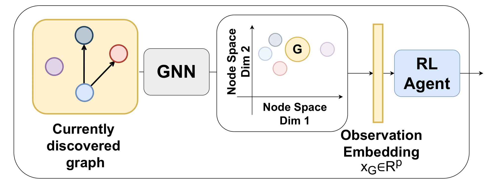
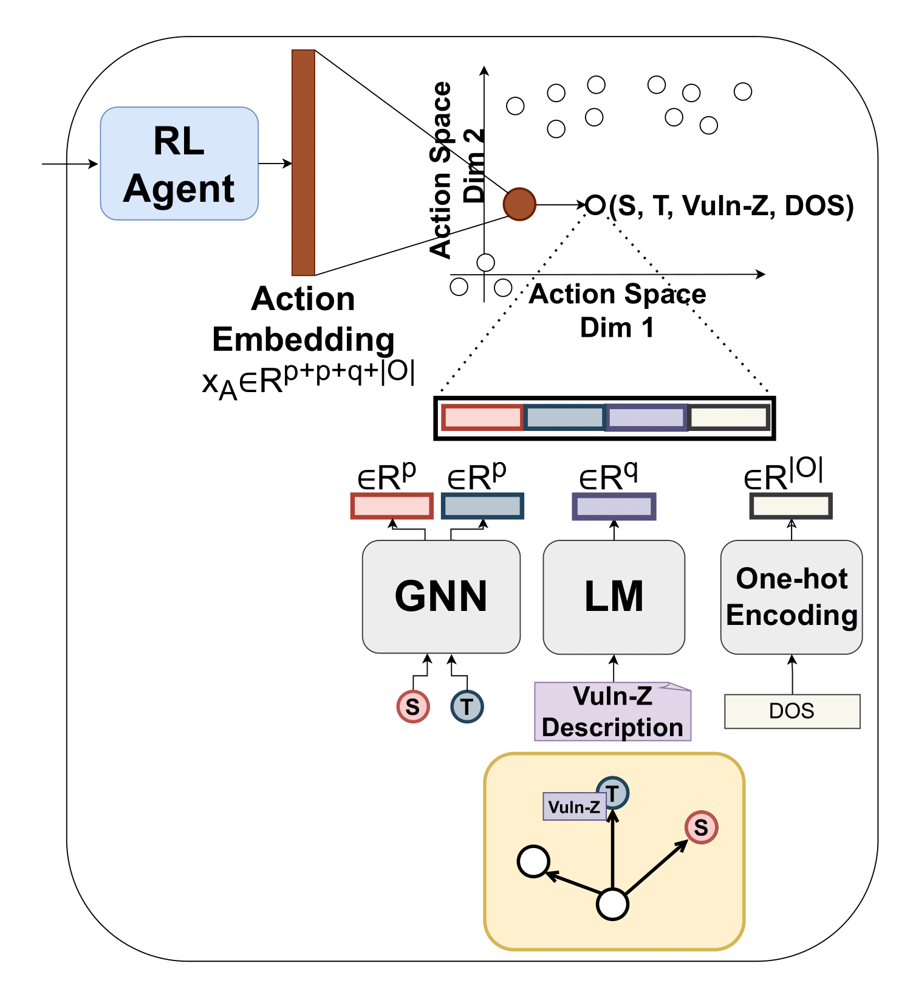

.. _drl_agents:

DRL Agent Spaces
================

A Deep Reinforcement Learning (DRL) agent is trained on multiple scenario representations to learn how to predict cyber-attack paths by selecting sequences of tuples: *(source node, target node, vulnerability, outcome)*. The objective is to maximize a reward function under partially observable and dynamically evolving scenario visibility.

To support generalization, the agent's **observation and action spaces** are designed as **continuous and fixed-dimensional embedding spaces**, independent of the specific characteristics of any scenario. This formulation enables the agent to train across heterogeneous environments and later be deployed in entirely new scenarios **without retraining**, as the learned mappings rely on **semantically meaningful embeddings** that are **scenario-agnostic** due to their fixed dimensionality and permutation invariance.

Continuous Observation Space
----------------------------

The agent's observation is the visible portion of the current scenario graph, as described in the Section `POMDP Formulation <pomdp.html>`_. This subgraph is encoded into a single graph-level embedding using the GAE Encoder introduced in the `World Model <world_model>`_.

Thus, at each timestep, the agent receives a vector :math:`\mathbf{h}_G \in \mathbb{R}^p`, where :math:`p` is the fixed dimensionality of the graph embeddings.

**Figure 9** – The observation vector comes from the GAE Encoder, which compresses the visible graph into a fixed-dimensional embedding.

Advantages over Discrete Global Observation Spaces
^^^^^^^^^^^^^^^^^^^^^^

In traditional approaches like the original CyberBattleSim, observations are flattened arrays that concatenate node feature vectors. These arrays depend on node ordering and vary in size with the graph, making them incompatible with standard feedforward networks without applying padding.

Padding, however, introduces limitations:

- Requires predefined maximum graph sizes.
- Sensitive to node ordering.
- Breaks when scenario graph changes dynamically.

Our approach **avoids these limitations** by using **permutation-invariant graph embeddings**, which are:

- Independent of node ordering.
- Fixed in size regardless of the scenario's complexity.
- Compatible with dynamic changes (e.g., as nodes are discovered or removed).

Continuous Action Space
-----------------------

The agent must learn to select an optimal action tuple: *(source node, target node, vulnerability, outcome)*. For this to generalize across scenarios with different topology graphs and vulnerabilities sets, the action space must also be **continuous and scenario-independent**.

**Figure 10** – The continuous action space is represented as a concatenation of embeddings for source and target nodes, vulnerabilities, and outcomes. The agent can predict an action in this space, then mapped to the closest valid action tuple.

We define a **continuous action space**, where each action is represented as a single embedding vector. Specifically:

- **Source and target nodes** are represented using their GAE-learned embeddings (each :math:`\mathbb{R}^p`).
- **Vulnerabilities** are embedded into :math:`\mathbb{R}^q` using NLP-based encoders (e.g., from descriptions).
- **Outcomes** are encoded as one-hot vectors of dimension :math:`|O|`, representing the MITRE ATT&CK tactics.

An action is represented as the concatenation :math:`\mathbf{a} \in \mathbb{R}^{2p + q + |O|}`. At inference time, the agent outputs a continuous vector of this shape, and a **nearest-neighbor search** is used to map it to the **closest valid action tuple** available in the current scenario.

Advantages over Discrete Global Action Spaces
^^^^^^^^^^^^^^^^^^^^^^^^^^

Traditional discrete action spaces are defined as :math:`|N| \times |N| \times |V| \times |O|`, where :math:`|N|` is the number of nodes, :math:`|V|` the number of vulnerabilities, and :math:`|O|` the number of outcomes. This formulation is:

- Dependent on graph size and ordering.
- Inflexible across scenarios with varying structure.
- Inefficient in large or dynamic topologies.

In contrast, our continuous action space:

- Is independent of scenario size or layout.
- Enables transferability across environments leveraging semantic similarity (e.g., similar nodes or vulnerabilities produce similar embeddings).
- Remains fixed in dimensionality, with dependency only on the outcome set, which is assumed constant across applications.

Action Set Pruning
^^^^^^^^^^^^^^
Removing the dependence on the number of actions also allows the possibility to introduce human knowledge into the action space by removing some invalid actions known apriori (e.g. those regarding vulnerabilities not contained in a node).
Infeasible actions can be pruned by applying domain knowledge by removing them from the proximity-based selection, without changing the underlying model.

Overall Formulation
--------------------------------------------

The overall policy function of the DRL agent is defined as follows:

.. math::

   \pi : \mathbb{R}^{p} \rightarrow \mathbb{R}^{2p + q + |O|} \\
   \text{with the objective:} \quad \max_{\pi} \, \mathbb{E}_{\tau \sim \pi} \left[\text{Impact}(\tau \mid \text{Goal})\right]

Where:

- :math:`\pi` is the policy function mapping observations to action embeddings.
- :math:`\tau` is a trajectory (sequence of actions) generated by following policy :math:`\pi`.
- The expected value of the impact of the path, conditioned on the goal, is maximized.

Dependence on the scenario size and ordering is eliminated (dependence on `N`), allowing the agent to generalize across different scenario graphs.
Dependence on the vulnerability set size and ordering is also removed (dependence on `V`), enabling the agent to adapt to new scenarios with different vulnerabilities.