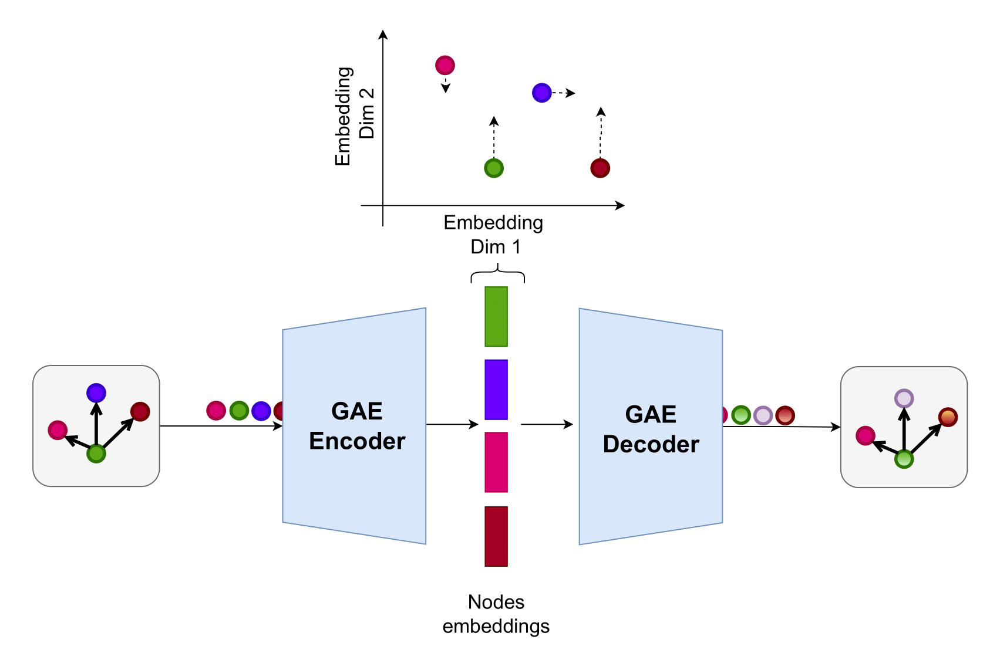
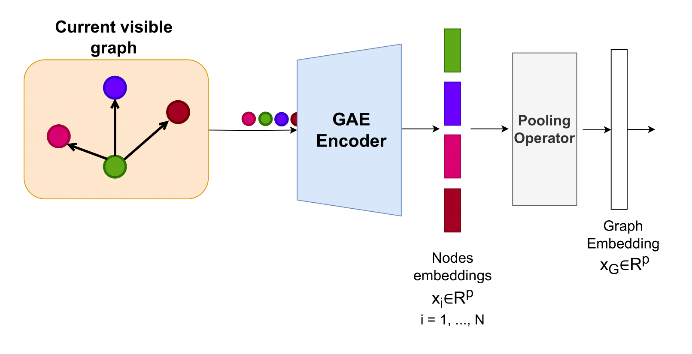

Embedding Model
===========

To train generalizable agents, the main environment elements — nodes, graphs, and vulnerabilities — are encoded into fixed-dimensional, semantically meaningful embeddings using an embedding (static world model).
This process is critical to ensure that the agent can generalize across different scenario graphs by leveraging a semantically meaningful embedding space, while avoiding dependencies on the size and ordering of elements through fixed-dimensional embeddings.
The embedding model consists mainly of two components:

- A **Graph Neural Network-based Autoencoder** (GAE) for graphs and nodes.
- **Natural Language Processing (NLP)** (in particular **Language Models**) extractors to represent textual information as meaningful embeddings, and in particular vulnerabilities.

Graph and Node Embeddings
-------------------------

Graph and node embeddings are generated using a GAE comprising Graph Neural Networks (GNNs).
To ensure semantic understanding of the graph structure, the GNN is pre-trained using unsupervised learning and then frozen for embedding generation.

The GAE architecture consists of a GNN-based *Encoder* followed by a simple feed-forward Neural Network *Decoder*.
At each time snapshot, the currently discovered scenario is represented as an evolving visible graph (see Section `POMDP Formulation <#pomdp-formulation>`_), which serves as input to the agent and hence should be transformed by the embedding model into a proper representation.

Reconstruction Loss Function
~~~~~~~~~~~~

The Graph Autoencoder (GAE) is trained in an unsupervised manner using a **domain-specific reconstruction loss**, designed to guide the encoder in learning meaningful representations of nodes. The total loss function is defined as:

.. math::

    \text{Total Loss} = \sum_{i \in V} \text{Loss}_{\text{node}_i}
    + \sum_{i \in V} \sum_{j \in V} \text{Loss}_{\text{edge}_{ij}}
    + \text{Loss}_{\text{adj}(G)} + \text{Diversity}_{\text{Embeddings}(V)}

Each component of the loss corresponds to a specific training goal:

- **Node Feature Reconstruction** (:math:`\sum_{i \in V} \text{Loss}_{\text{node}_i}`): Encourages the accurate reconstruction of the original node features, so that the embedding preserves the key characteristics of each node.
- **Edge Feature Reconstruction** (:math:`\sum_{i \in V} \sum_{j \in V} \text{Loss}_{\text{edge}_{ij}}`): Guides the model to correctly capture the connections and interactions between nodes, representing exploited vulnerabilities, by reconstructing the edge features.
- **Graph Structure Preservation** (:math:`\text{Loss}_{\text{adj}}(G)`): Enforces the preservation of the original adjacency structure by penalizing differences between the input and reconstructed graph topology, helping encode the neighborhood context.
- **Embedding Diversity Regularization** (:math:`\text{Diversity}_{\text{Embeddings}}(V)`): Prevents the embeddings from collapsing into a single point by encouraging diversity among node representations.

After training, the **Decoder** is discarded. The remaining **Encoder** is used to generate meaningful and compact node embeddings for downstream tasks.

**Figure 7** – The GAE is trained to compress the nodes into fixed-dimensional embeddings using an encoder-decoder architecture.

The trained encoder maps each node to an embedding vector :math:`h_v = \text{Encoder}(v)`.
A graph-level embedding can be then computed by aggregating the embeddings of all nodes:

.. math::

    \mathbf{h}_G = \mathrm{AGGREGATE} \left( \left\{ \mathbf{h}_v : v \in V \right\} \right)

where:

- :math:`\mathbf{h}_G` is the graph embedding,
- :math:`\mathbf{h}_v` is the embedding of node :math:`v`,
- :math:`V` is the set of all nodes in the graph,
- :math:`\mathrm{AGGREGATE}` is a permutation-invariant function (e.g., mean pooling) ensuring order invariance.

**Figure 8** – The graph embedding is derived by aggregating the node embeddings, capturing the entire graph structure in a fixed-dimensional vector.

GAE Training
~~~~~~~~~~~~

To train the GAE model, use the following command:

.. code-block:: bash

    cd cyberbattle/gae

    python3 train_gae.py \
        --name LOGS_FOLDER_NAME \
        --num_runs NUM_RUNS \
        --holdout \
        --load_envs ENVS_FOLDER \
        --nlp_extractors NLP_EXTRACTORS_LIST \
        --load_seeds SEEDS_FILE \ OR
        --random_seeds

-- ``--name`` specifies the output logs folder name.
- ``--num_runs`` sets how many times the model is trained (each time with a different seed).
- The ``--holdout`` flag splits scenarios into training and validation sets, allowing evaluation of generalization on unseen graphs.
- ``--load_envs`` specifies the folder containing scenario data (if not specified, default scenario set is used).
- ``--nlp_extractors`` lists NLP extractors; a separate GAE is trained for each extractor to adapt to varying service and vulnerability embeddings.
- ``--load_seeds`` specifies a file with seeds for reproducibility, or ``--random_seeds`` can be used to generate random seeds for each run.

Additional configuration options are in ``cyberbattle/gae/config/train_config.yaml``, including architecture details, iteration counts, episode setup, and other hyperparameters.

GAE Logs Folder Structure
~~~~~~~~~~~~~~~~~~~~~~~~~~~~~~~~~

Training outputs a logs folder with models, tensorboard logs, and config files for reproducibility, with structure:

.. code-block:: text

    .
    ├── app.log                          # Log for output and errors
    ├── CySecBERT/                       # Model directory for CySecBERT
    │   ├── encoder.pth                  # Encoder state dict
    │   ├── events.out.tfevents...       # TensorBoard events file
    │   ├── model.pth                    # Full model state dict
    │   ├── model_spec.yaml              # Model architecture spec
    │   ├── split.yaml                   # Data split info
    │   └── train_config_encoder.yaml   # Encoder training config
    ├── ...                             # Other NLP extractors
    ├── envs/                           # Scenario environment folder
    │   ├── CySecBERT/                  # Scenarios for CySecBERT
    │   │   ├── 1.pkl                  # Scenario instance 1
    │   │   ├── 2.pkl                  # Scenario instance 2
    │   │   └── ...                    # More scenarios
    │   └── ...

TensorBoard logs can be visualized by running:

.. code-block:: bash

    tensorboard --logdir=LOGS_FOLDER_NAME

Open the provided URL in a browser to access the TensorBoard interface.

GAE Hyper-parameters Optimization
~~~~~~~~~~~~~~~~~~~~~~~~~~~~~~~~~

GAE hyperparameters can be optimized using the Optuna library, included in the project.
Run hyperparameter optimization with:

.. code-block:: bash

    python3 hyperopt_gae.py \
        ..... \
        --num_trials NUM_TRIALS \
        --optimization_type {grid, random, tpe, cmaes, ...}

- ``--num_trials`` sets the number of optimization trials.
- ``--optimization_type`` specifies the search algorithm.

Search ranges for hyperparameters (learning rate, layers, hidden units, etc.) are defined in ``cyberbattle/gae/config/hyperparams_ranges.yaml``.
Optimization minimizes the reconstruction loss on the validation set (or training set if ``--holdout`` is not set).
The optimization progress can be monitored via the Optuna database and dashboard:

.. code-block:: bash

    optuna dashboard --storage sqlite:///cyberbattle/gae/logs/LOGS_FOLDER/gae_hyperopt.db

GAE Integration
~~~~~~~~~~~~

A default pre-trained GAE model is provided with the project and can be downloaded using ``setup.py``.
You can retrain the GAE on custom scenario sets and update the specifying a different path in the root ``config.yaml`` file.

.. code-block:: yaml

    gae_path: gae_logs_folder_name # relative to cyberbattle/gae/logs

Vulnerability Embeddings
------------------------

Vulnerabilities are encoded into fixed-dimensional embeddings using pre-trained NLP models, particularly LMs.
The embeddings are generated from the free-text vulnerability descriptions, which include details on the vulnerability and its impact.
Embedding generation occurs live during data scraping (see Section `Data Scraping <data_scraping.html>`_), where vulnerability embeddings are extracted once and stored in the database for later usage.
The specific NLP extractors used for vulnerability embeddings are specified in the ``--nlp_extractors`` option of each pipeline stage.
Existing LMs can be further fine-tuned for representation learning on vulnerability data to enhance the quality of the embeddings.