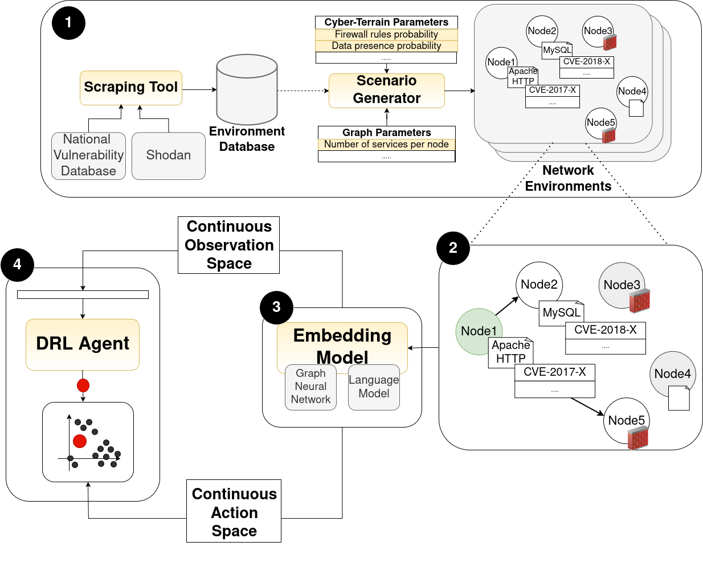

.. _home:

**Welcome to the Documentation!**
===================================

Welcome to the documentation for `Continuous CyberBattleSim <https://github.com/terranovafr/C-CyberBattleSim>`_, an advanced extension of Microsoft’s CyberBattleSim [1]_. While the original project serves as a research platform for exploring autonomous agents in enterprise networks, this version introduces a complete pipeline—from **real-world data acquisition** to training and evaluation of **scalable, generalizable DRL agents**—using **continuous scenario representations**.

Main Contributions
-----------------------------

**Figure 1** – Overview of the main contributions introduced in the C-CyberBattleSim project.

This repository builds upon the CyberBattleSim framework by introducing a modular, multi-stage pipeline with the following core components:

**1. Automated Scenario Generation**
   - Leverages Shodan [2]_ and NVD [3]_ data to extract real-world service distributions and vulnerabilities. It uses this data to generates diverse synthetic scenarios via domain randomization based on configurable parameters.
   - 📄 Docs: `Data Scraping <data_scraping.html>`_, `Scenario Generation <scenario_generation.html>`_

**2. Game Reformulation**
   - Models the attack environment as a **Partially Observable Markov Decision Process** (POMDP) [8]_, allowing more realistic and effective learning.
   - 📄 Docs: `POMDP Formulation <pomdp.html>`_

**3. Embedding Model Learning**
   - Uses Graph AutoEncoders and Language Models (from HuggingFace [6]_) to embed graph and vulnerability information into latent continuous spaces.
   - 📄 Docs: `Embedding Model <embedding_model.html>`_

**4. Invariant Agent Architecture**
   - Defines observation and action spaces that are independent of specific graph topologies or vulnerability sets by leveraging the previously described latent representations. This framework supports the training of DRL algorithms using Stable-Baselines3 implementations [5]_, and enables direct comparison with the global and local space formulations introduced in prior work [7]_.
   - 📄 Docs: `Agent Spaces <drl_agents.html>`_, `Agent Training <train_agent.html>`_, `Agent Testing <test_agent.html>`_

🧪 It is possible to explore all or a subset of these features, depending on the specific requirements of the research or project. If some sections are not explored, it is possible to download and use default available database, scenarios, and models with an automated script.
The project includes and integrate the API of reliable libraries and a simple and intituitive Command Line Interface (CLI) to setup experiments.

Advanced Features
-----------------------------

These optional modules provide deeper control over agent behavior and environment dynamics:

**Reward Function Design**
   - Tailored reward shaping to prioritize specific attack behaviors and learning objectives.
   - 📄 Docs: `Reward Function <reward_function.html>`_

**MITRE ATT&CK Tactics Classification**
   - Maps vulnerability descriptions to MITRE ATT&CK [4]_ tactics to model the approximation of vulnerabilities' impact on the environment.
   - 📄 Docs: `MITRE Classification <mitre_classification.html>`_

**Static Defender Agents**
   - Adds hard-coded defenders that react to attacker behavior, introducing variability and unpredictability.
   - 📄 Docs: `Static Defenders <static-defenders.html>`_

Paper Reference
-----------------------------

*Franco Terranova, Abdelkader Lahmadi, Isabelle Chrisment. Scalable and Generalizable RL Agents for Attack Path Discovery via Continuous Invariant Spaces. The 28th International Symposium on Research in Attacks, Intrusions and Defenses (RAID 2025).*

The paper elaborates on the full pipeline and experimental results.

Citation
~~~~~~~~~~~~~~~~

Use the following BibTeX entry to cite this project:

.. code-block:: bibtex

    @inproceedings{terranova2025scalable,
      author    = {Terranova, Franco and Lahmadi, Abdelkader and Chrisment, Isabelle},
      title     = {Scalable and Generalizable RL Agents for Attack Path Discovery via Continuous Invariant Spaces},
      booktitle = {28th International Symposium on Research in Attacks, Intrusions and Defenses (RAID 2025)},
      year      = {2025},
      month     = {Oct},
      address   = {Gold Coast, Australia},
      pages     = {18},
    }

License
-----------------------------

This project is released under the **MIT License**, a permissive open-source license that allows free use, modification, and distribution of the code, provided that the original copyright and license notice are included in all copies or substantial portions of the software.
For the full terms, see the `LICENSE <https://github.com/terranovafr/C-CyberBattleSim/LICENSE>`_ file in the repository.

Resources
-----------------------------

- `Project Repository <https://github.com/terranovafr/C-CyberBattleSim>`_
- `Microsoft CyberBattleSim <https://github.com/microsoft/CyberBattleSim>`_
- `Zenodo Dataset <https://doi.org/10.5281/zenodo.14604651>`_ for full reproducibility

References
~~~~~~~~~~~~~~~~~

.. [1] Microsoft Defender Research Team. 2021. CyberBattleSim. https://github.com/microsoft/cyberbattlesim Created by Christian Seifert, Michael Betser, William Blum, James Bono, Kate Farris, Emily Goren, Justin Grana, Kristian Holsheimer, Brandon Marken, Joshua Neil, Nicole Nichols, Jugal Parikh, Haoran Wei..
.. [2] John Matherly. 2024. Shodan. Online. https://www.shodan.io, Accessed: 2024-07-31
.. [3] Harold Booth and Doug Rike and Gregory Witte. 2013. The National Vulnerability Database (NVD: Overview. ITL Bulletin. National Institute of Standards and Technology, Gaithersburg, MD. https://tsapps.nist.gov/publication/get_pdf.cfm?pub_id=915172
.. [4] Blake E Strom, Andy Applebaum, Doug P Miller, Kathryn C Nickels, Adam G Pennington, and Cody B Thomas. 2018. Mitre att&ck: Design and philosophy. In Technical report. The MITRE Corporation.
.. [5] Antonin Raffin, Ashley Hill, Adam Gleave, Anssi Kanervisto, Maximilian Ernestus, and Noah Dormann. 2021. Stable-Baselines3: Reliable Reinforcement Learning Implementations. Journal of Machine Learning Research 22, 268 (2021), 1–8. http://jmlr.org/papers/v22/20-1364.html
.. [6] Thomas Wolf, Lysandre Debut, Victor Sanh, Julien Chaumond, Clement Delangue, Anthony Moi, Pierric Cistac, Tim Rault, Rémi Louf, Morgan Funtowicz, Joe Davison, Sam Shleifer, Patrick von Platen, Clara Ma, Yacine Jernite, Julien Plu, Canwen Xu, Teven Le Scao, Sylvain Gugger, Mariama DrameQuentin Lhoest, and Alexander M. Rush. 2020. HuggingFace’s Transformers: State-of-the-art Natural Language Processing. arXiv:1910.03771 [cs.CL] https://arxiv.org/abs/1910.03771
.. [7] Franco Terranova, Abdelkader Lahmadi, and Isabelle Chrisment. 2024. Leveraging Deep Reinforcement Learning for Cyber-Attack Paths Prediction: Formulation, Generalization, and Evaluation. In *Proceedings of the 27th International Symposium on Research in Attacks, Intrusions and Defenses (RAID '24)*. Association for Computing Machinery. https://doi.org/10.1145/3678890.3678902
.. [8] George E. Monahan. 1982. State of the Art—A Survey of Partially Observable Markov Decision Processes: Theory, Models, and Algorithms. *Management Science*. https://doi.org/10.1287/mnsc.28.1.1

.. [9] John Schulman, Filip Wolski, Prafulla Dhariwal, Alec Radford, and Oleg Klimov. 2017. Proximal Policy Optimization Algorithms. arXiv:1707.06347 [cs.LG] https://arxiv.org/abs/1707.06347
.. [10] John Schulman, Sergey Levine, Philipp Moritz, Michael I. Jordan, and Pieter Abbeel. 2017. Trust Region Policy Optimization. arXiv:1502.05477 [cs.LG] https://arxiv.org/abs/1502.05477
.. [11] Scott Fujimoto, Herke van Hoof, and David Meger. 2018. Addressing Function Approximation Error in Actor-Critic Methods. arXiv:1802.09477 [cs.AI] https://arxiv.org/abs/1802.09477
.. [12] Arsenii Kuznetsov, Pavel Shvechikov, Alexander Grishin, and Dmitry Vetrov. 2020. Controlling Overestimation Bias with Truncated Mixture of Continuous Distributional Quantile Critics. arXiv:2005.04269 [cs.LG] https://arxiv.org/abs/2005.04269
.. [13] Tuomas Haarnoja, Aurick Zhou, Pieter Abbeel, and Sergey Levine. 2018. Soft Actor-Critic: Off-Policy Maximum Entropy Deep Reinforcement Learning with a Stochastic Actor. arXiv:1801.01290 [cs.LG] https://arxiv.org/abs/1801.01290
.. [14] Marco Pleines, Matthias Pallasch, Frank Zimmer, and Mike Preuss. 2022. Generalization, Mayhems and Limits in Recurrent Proximal Policy Optimization. arXiv:2205.11104 [cs.LG] https://arxiv.org/abs/2205.11104
.. [15] Volodymyr Mnih, Adrià Puigdomènech Badia, Mehdi Mirza, Alex Graves, Timothy P. Lillicrap, Tim Harley, David Silver, and Koray Kavukcuoglu. 2016. Asynchronous Methods for Deep Reinforcement Learning. arXiv:1602.01783 [cs.LG] https://arxiv.org/abs/1602.01783

.. [16] Jacob Devlin, Ming-Wei Chang, Kenton Lee, and Kristina Toutanova. 2019. BERT: Pre-training of Deep Bidirectional Transformers for Language Understanding. arXiv:1810.04805 [cs.CL] https://arxiv.org/abs/1810.04805
.. [17] Victor Sanh, Lysandre Debut, Julien Chaumond, and Thomas Wolf. 2020. DistilBERT, a distilled version of BERT: smaller, faster, cheaper and lighter. arXiv:1910.01108 [cs.CL] https://arxiv.org/abs/1910.01108
.. [18] Alec Radford, Jeff Wu, Rewon Child, David Luan, Dario Amodei, and Ilya Sutskever. 2019. Language Models are Unsupervised Multitask Learners. https://api.semanticscholar.org/CorpusID:160025533
.. [19] Vinhan Liu, Myle Ott, Naman Goyal, Jingfei Du, Mandar Joshi, Danqi Chen, Omer Levy, Mike Lewis, Luke Zettlemoyer, and Veselin Stoyanov. 2019. RoBERTa: A Robustly Optimized BERT Pretraining Approach. arXiv:1907.11692 [cs.CL] https://arxiv.org/abs/1907.11692
.. [20] Markus Bayer, Philipp Kuehn, Ramin Shanehsaz, and Christian Reuter. 2022. CySecBERT: A Domain-Adapted Language Model for the Cybersecurity Domain. arXiv:2212.02974 [cs.CR] https://arxiv.org/abs/2212.02974
.. [21] Kun. 2024. SecBERT: A Pretrained Language Model for Cyber Security Text. https://github.com/jackaduma/SecBERT/. Accessed: 2024-07-30
.. [22] Kun. 2024. SecBERT: A Pretrained Language Model for Cyber Security Text. https://github.com/jackaduma/SecBERT/. Accessed: 2024-07-30
.. [23] Ehsan Aghaei, Xi Niu, Waseem Shadid, and Ehab Al-Shaer. 2023. SecureBERT: A Domain-Specific Language Model for Cybersecurity. In Security and Privacy in Communication Networks, Fengjun Li, Kaitai Liang, Zhiqiang Lin, and Sokratis K. Katsikas (Eds.). Springer Nature Switzerland, Cham, 39–56.
