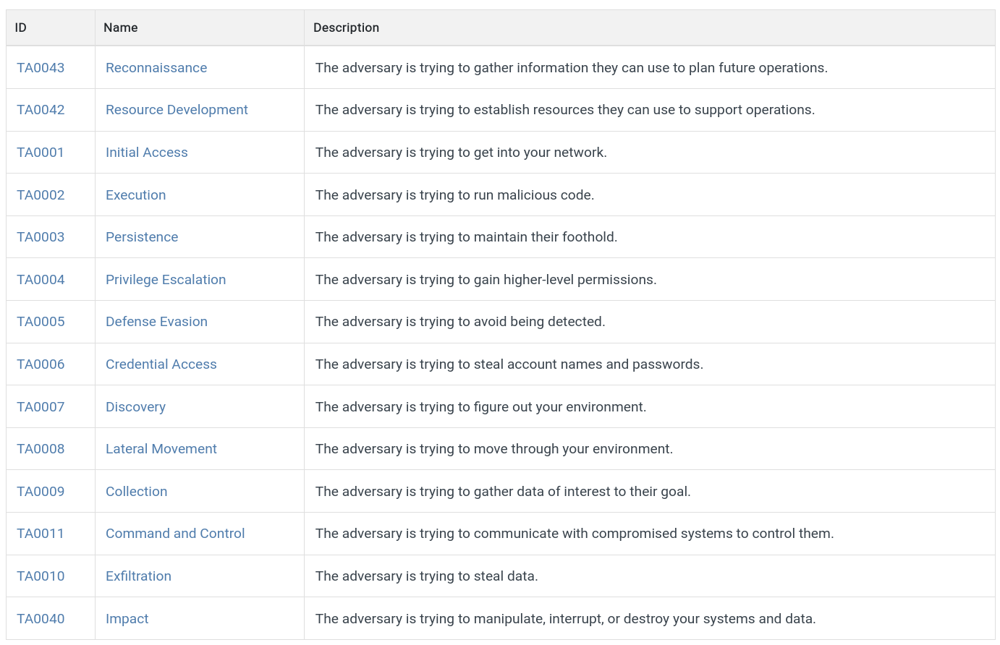
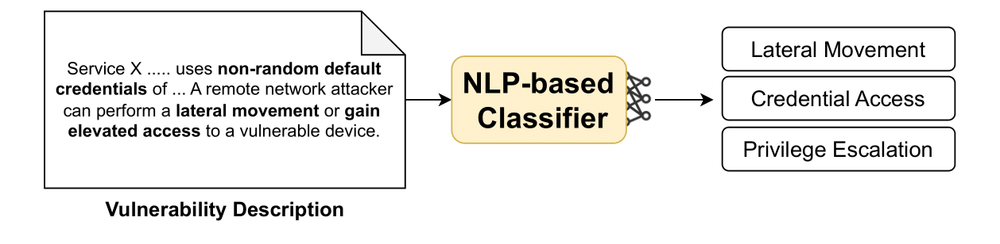

MITRE ATT&CK Tactics Classification
===================================

Understanding the impact of vulnerabilities is essential to building a realistic learning environment for RL agents—especially in scenarios populated with real-world services and vulnerabilities. Agents learn by interacting with this environment: they receive rewards and transition between states based on the simulated impact of their chosen actions.

Accurately modeling the outcome of each exploited vulnerability is therefore critical. However, these outcomes are typically described in unstructured, free-text format vulnerability descriptions. Manually labeling each vulnerability is infeasible, especially as the database may be frequently updated or regenerated. This necessitates an automated, scalable solution.

MITRE ATT&CK Tactics Set
-------------------------

To classify the effects of vulnerabilities, we rely on the **MITRE ATT&CK Tactics** framework. It defines 14 high-level attacker goals (or tactics), offering a standardized taxonomy for adversarial behavior.

**Figure 11** – The MITRE ATT&CK Tactics set.

Multi-Label Classification
--------------------------

To automatically assign one or more MITRE ATT&CK Tactics to each vulnerability, we train a **multi-label classifier**. This approach allows the environment to encode only the **tactic-level outcome** of each vulnerability, instead of simulating its full technical effect.
The automated classification using a NLP-based classifier finetuned for this task enables:
- Generalization across vulnerabilities, even for newly added ones.
- Automated environment updates with minimal human intervention.
- Reduced error from manual labeling or rule-based logic.

**Figure 12** – The NLP-based multi-label classifier automatically assigns MITRE ATT&CK Tactics to vulnerabilities based on their descriptions.

Model Integration
-----------------

In our system, we classify vulnerabilities into **11 of the 14 MITRE tactics**. These include: Discovery, Reconnaissance, Collection, Exfiltration, Execution, Privilege Escalation, Lateral Movement, Credential Access, Denial of Service *(replacing MITRE's "Impact")*, Persistence, and Defense Evasion.
Additionally, a *"No Class"* label is assigned to vulnerabilities whose descriptions do not clearly map to any tactic.
This set extends the original CyberBattleSim implementation, which only included five tactics: *Reconnaissance, Credential Access, Lateral Movement, Discovery,* and *Privilege Escalation*. Our expanded set improves the realism and fidelity of the simulation.

To choose the best classifier for integration, we fine-tuned and evaluated several LMs on a labeled dataset. The selected model, **SecureBERT**, achieved an **F1-score of 0.76** on a held-out test set. We also confirmed the performance improvement using a **Mann–Whitney U test** (significance level: 0.08).
The fine-tuned SecureBERT classifier is fully integrated and downloaded automatically during the environment setup process.

To use a custom classifier, users may update the ``config.yaml`` file by specifying the path or Hugging Face identifier of the desired model:

.. code-block:: yaml

   vulnerability_classifier_url: "https://www.dropbox.com/scl/fi/u0t4pk9os7b4rtqi6k80x/classifier.zip?rlkey=vxmk7h45h8bm2bt4xt3xzjdn9&st=6lr939va&dl=1"
   vulnerability_classifier_base_identifier: "ehsanaghaei/SecureBERT"
   vulnerability_classifier_README_url: "https://www.dropbox.com/scl/fi/yol4ga7uuvvahmnyo0skl/README.md?rlkey=dc29gi0bzd300eln21rsnd8ci&st=r6ioozsi&dl=1"
   vulnerability_classifier_path: "classifier" # relative to cyberbattle/models

Upon updating this configuration, the environment ``setup.py`` script should be re-run to download the specified model.
The data scraping process should be re-run as well to regenerate the vulnerability database with updated class labels.
The labeling process is in fact performed only once at database creation time to minimize runtime overhead during agent interaction.
