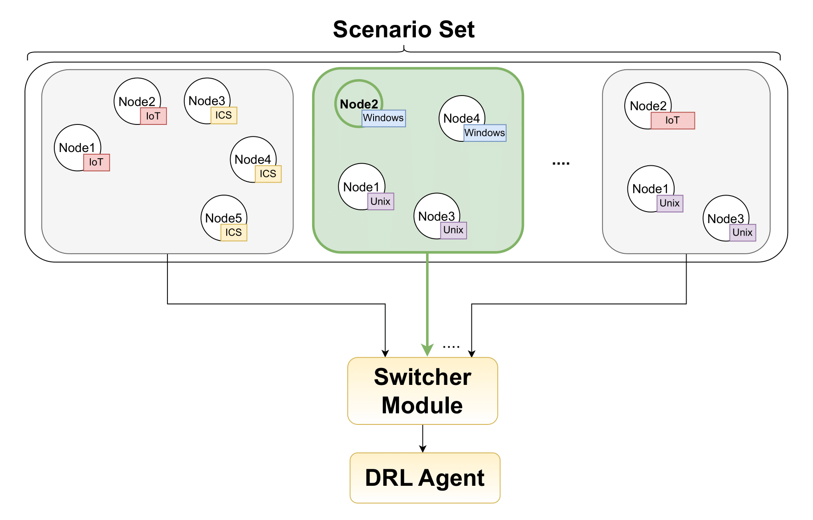
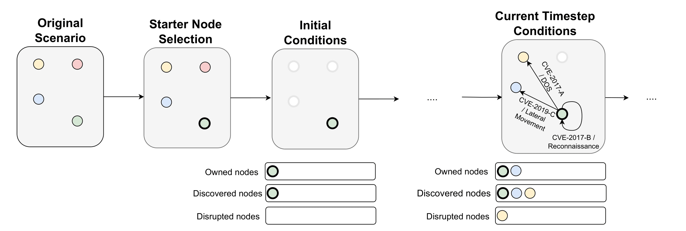
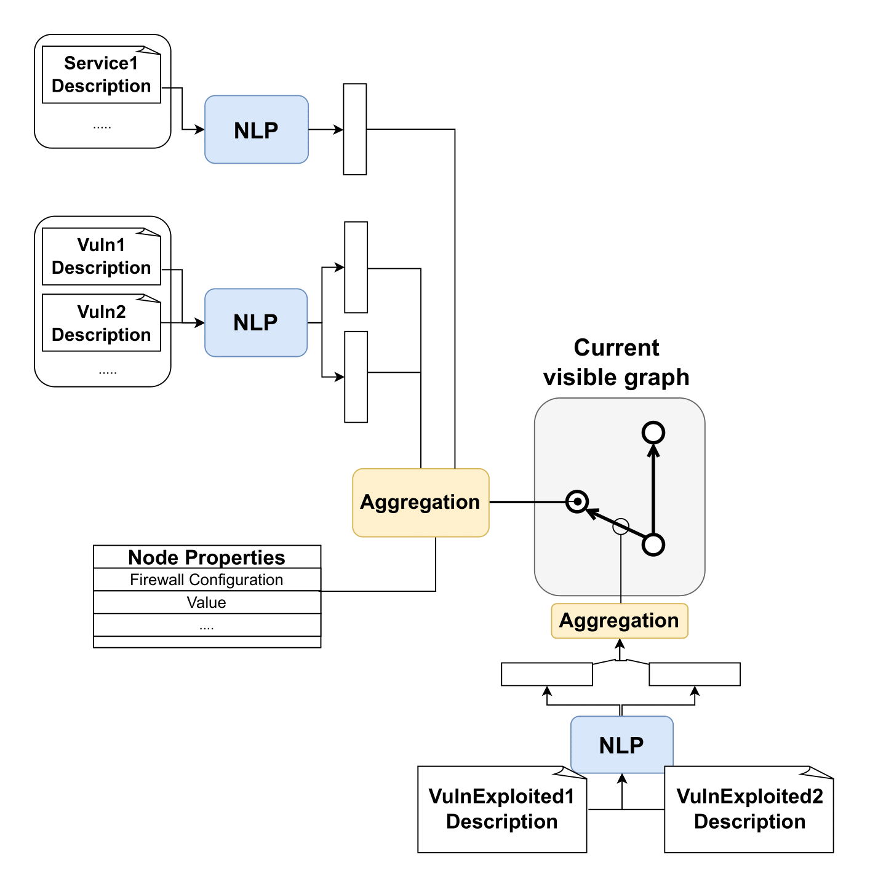
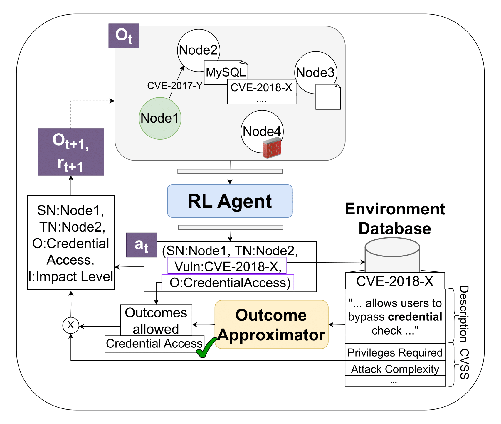

.. _pomdp:

POMDP Formulation
=================

We model the environment as a Partially Observable Markov Decision Process (POMDP).
The agent begins with limited visibility — owning a single starter node — and must expand its view by discovering other nodes through interaction. As it explores and acts upon the evolving scenario graph, it learns to navigate and adapt based on partial observations driven by its actions.

Domain Randomization and Scenario Switching
-------------------------------------------

As described in the `Scenario Generation <scenario_generation.html>`_ section, the environment generator produces a collection of scenarios, optionally split into training, validation, and test sets. These scenarios vary in terms of service and vulnerability allocations, network size, and cyber-terrain configurations.

To encourage generalization, we apply *domain randomization* by periodically switching between scenarios during training, validation, or testing. This is controlled via the ``switch_interval`` parameter (in episodes). Exposure to multiple environments allows the agent to learn more robust and transferable behaviors.

**Figure 3** – Switcher module varying scenario and starter node.

Scenario switching can target the training set (impacting learning) or be applied during evaluation to test generalization capabilities.

Episode Evolution
-----------------

Within each scenario — which remains fixed for ``switch_interval`` episodes — the agent starts each episode from a randomly selected starter node. This selection can be constrained to ensure reachability, avoiding episodes where the agent would be unable to act effectively.

**Figure 4** – Each episode starts from a randomly selected starter node, with the agent's actions expanding its view of the environment and the progression of the status lists.

At each timestep, the agent selects a tuple *(source node, target node, vulnerability, outcome)*:

- **Source node**: A node currently owned by the agent.
- **Target node**: A discovered node (can be the same as the source for local exploits).
- **Vulnerability**: A vulnerability present on the target node.
- **Outcome**: A potential effect of exploiting the vulnerability, mapped to a MITRE ATT&CK tactic.

Outcome selection is critical — many vulnerabilities allow multiple outcomes (e.g., code execution, persistence). The environment verifies each action using the database, checking node states, firewalls, and vulnerability metadata.
At the start of each episode, the agent's known world includes only the starter node (owned and discovered). Over time, successful actions expand the discovered and owned node sets, increasing the agent’s range of options as source and target nodes.

Input Graph Representation
--------------------------

At each timestep, the agent receives a graph-based observation where:

- Nodes represent discovered machines, each described by a feature vector.
- Edges capture historical exploitations between nodes.

Node Representation
^^^^^^^^^^^^^^^^^^^

Each node's feature vector encodes:

- **Discrete flags** (e.g., visibility, data presence) as one-hot values.
- **Status indicators** (e.g., privilege level, SLA weight, service state).
- **Aggregated feature vectors** for hosted services and known vulnerabilities, including semantic embeddings extracted via NLP.

Example (YAML-style):

.. code-block:: yaml

    firewall_config_array_incoming: [0, 0, ..., 1]  # Per-service incoming firewall rules
    firewall_config_array_outgoing: [0, 0, ..., 1]  # Outgoing rules
    visible: 1
    persistence: 1
    data_presence: 1
    data_collected: 0
    data_exfiltrated: 0
    defense_evasion: 0
    reimageable: 0
    privilege_level: 3        # 0 = none, 1 = user, 3 = root
    status: 1                 # 0 = stopped, 1 = running, 2 = re-imaging
    value: 100
    sla_weight: 1
    services_feature_vector_aggregations: [0.121, 0.2392, ..., 0.365]
    vulnerabilities_feature_vector_aggregations: [0.121, 0.2392, ..., 0.365]

Edge Representation
^^^^^^^^^^^^^^^^^^^

Edges are added during successful exploitations and capture the history of how the agent moved through the environment.
Each edge’s feature vector includes embeddings of the exploited vulnerabilities, capturing their semantics.

**Figure 5** – Representation of the graph structure overlaying the scenario, with nodes and edges feature vectors.

This edge structure gives the agent access to key contextual information: service and vulnerability semantics, and past attack paths.

Outcome Approximation
---------------------

After selecting a valid *(source node, target node, vulnerability, outcome)* tuple, the environment simulates the result of the attempted exploitation:

**Figure 6** – The selected outcome is assessed against the ones allowed by the vulnerability, and additional CVSS vector components are used to weight the impact of the action.

Before applying the outcome, the environment performs the following checks:

- **Ownership & visibility**: Source must be owned; target must be discovered and running.
- **Vulnerability match**: The chosen vulnerability must exist on the target.
- **Outcome validity**: Must align with the multi-label classifier output (MITRE ATT&CK tactics) allowed by the vulnerability chosen.
- **Firewall rules**: Must permit communication between source and target.
- **Service state**: Target service must be running.
- **CVSS components**:

  - *Attack Vector* (local/remote exploitability).
  - *Privileges Required* (agent must meet the minimum privilege level).
  - *Attack Complexity* (used as a success probability estimate).
  - *Confidentiality Impact* (e.g., for Reconnaissance outcomes).

If all conditions are met, the simulated outcome updates the graph and node states accordingly.
A detailed table of outcomes and simulation logic is provided in the next section.

.. list-table:: MITRE ATT&CK Tactic Simulation
   :header-rows: 1
   :class: tight-table

   * - MITRE ATT&CK Tactic
     - Node Simulation
     - Vulnerability Outcome Simulation
   * - Collection
     - Some nodes are simulated with data presence (binary variable).
     - Collects data from node if present and not yet collected.
   * - Exfiltration
     - Some nodes simulated with data presence.
     - Exfiltrates data to an external device after collection.
   * - Discovery
     - Nodes have partial visibility; non-visible features are represented by being zeroed out (e.g., vulnerabilities, firewall config).
     - Discovers hidden node features.
   * - Reconnaissance
     - Nodes with this vulnerability enable discovery of other nodes, e.g., node IDs stored in files.
     - Discovers other nodes probabilistically based on confidentiality impact.
   * - Lateral Movement
     - Agent owning a node uses vulnerabilities to move to others.
     - Moves to target node with initial privilege level (root or basic) probabilistically assigned.
   * - Credential Access
     - Nodes have services allowing credential logins.
     - Simulated similarly to lateral movement.
   * - Defense Evasion
     - Nodes simulate defense evasion techniques.
     - Agent bypasses firewall filtering; defender cannot use the node.
   * - Persistence
     - Nodes can execute software at startup (including malicious).
     - Agent control persists after node reboot.
   * - Privilege Escalation
     - Nodes have initial access levels.
     - Escalates agent's access to ROOT if not already ROOT.
   * - Denial of Service (replaces Impact)
     - Nodes can be shut down.
     - Shuts down target node, removing it from the network.
   * - Execution
     - Nodes allow execution of arbitrary software.
     - Enables agent to perform any prior MITRE ATT&CK tactic.

Episode Termination
-------------------

The episode ends when the agent reaches a terminal state, triggered by the first of the following optional conditions:

- **Truncated episode length**: episode ends after a fixed number of steps.
- **Truncated proportional episode length**: episode ends after a number of steps proportional to scenario size.
- **Episode goal reached**: episode ends when the agent achieves its goal, which varies by threat model (see `Reward Function <reward_function.html>`_ section).
- **Episode lost**: episode ends if the agent is stopped by a defender agent (if present, see `Static Defender Agent <static_defenders.html>`_ section).
