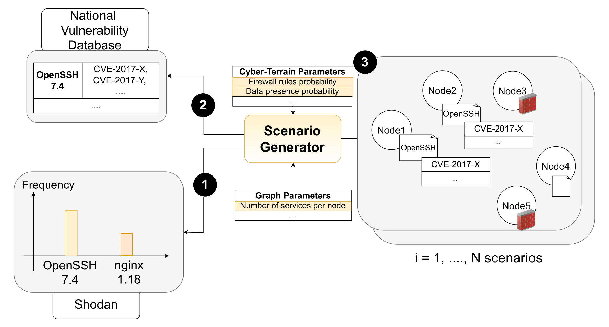

.. _scenario-generation:

Scenario Generation
===================

To simulate realistic and varied network environments, a **smart allocation strategy** is used when generating graph-based scenarios. This strategy assigns services and vulnerabilities to nodes while embedding configurable **cyber-terrain features**. These scenarios are generated based on the environment database (generated using a specific Shodan query) defined in the root-level ``config.yaml``.

Configuration Parameters
-------------

Before generating scenarios, customize the parameter ranges used for domain randomization in the following file ``cyberbattle/env_generation/config/generation_config.yaml``.
Each scenario is generated by sampling values from the specified ranges to create diversity among scenarios exposed to the agent during training and evaluation, and hence encourage generalization. Below is an example:

.. code-block:: yaml

    num_nodes_range: [10, 100]
    num_services_range: [1, 3]
    firewall_rule_incoming_probability_range: [0, 0.33]
    firewall_rule_outgoing_probability_range: [0, 0.33]
    knows_neighbor_probability_range: [0.2, 0.8]
    data_presence_probability_range: [0.2, 0.8]
    partial_visibility_probability_range: [0.2, 0.8]
    need_to_escalate_probability_range: [0.2, 0.8]
    service_shutdown_probability_range: [0, 0.2]
    success_rate_probability_range: [0.6, 1]
    ...

Cyber-terrain features model **obstacles** and challenges to the agent:

- **Firewall rules**: Control port-based access (incoming/outgoing).
- **Partial visibility**: Limits visibility to a node feature vector that can be unlocked with a `Discovery` vulnerability action.
- **Privilege escalation requirements**: Forces multi-step exploitation, simulating a probabilistic range of ROOT privileges need on each node.
- **Exploit success rates**: Introduces a probabilistic risk of failure when exploiting vulnerabilities.
- **Service shutdown**: Models inactive or down services making their vulnerabilities inaccessible.

Additional **valuable elements** are modeled:

- **Data presence and value**: Simulates a certain importance value for node and the presence of data.
- **Neighbor discovery**: Models the probability of discovering other neighbor nodes probabilistically when launching a `Reconnaissance` vulnerability action.

These features are also used to compute a **scenario complexity metric** used to categorize how complex scenarios are.

Generation Command
------------------

To generate scenarios, run the following from the scenario generation module:

.. code-block:: bash

    cd cyberbattle/env_generation

    python generate_graphs.py \
        --name ENVS_FOLDER_NAME \
        --num_graphs NUM_SCENARIOS \
        --percentage_type {iot, routers, windows, unix, ics, mixed_equally, random} \
        --split_train TRAINING_SET_PERCENTAGE \
        --split_val VALIDATION_SET_PERCENTAGE \
        --nlp_extractors NLP_EXTRACTORS

This command generates a folder under ``cyberbattle/data/env_samples/ENVS_FOLDER_NAME``, containing graph scenarios and configuration logs.

- ``--percentage_type``: Defines how node types (e.g., IoT, Windows) are assigned to nodes.

  - e.g., ``iot`` assigns all nodes as IoT.
  - ``mixed_equally`` assigns equal proportions of each type.
  - ``random`` samples types randomly.
- ``--split_train`` and ``--split_val``: Define training and validation set sizes. The test set is implicitly derived. Splitting is achieved using the complexity metric (most complex in the test set, less complex in the validation set, and least complex in the training set).
- ``--nlp_extractors``: One or more NLP extractors to embed services and vulnerabilities in the feature vectors.

Service Allocation Logic
-------------------------

The script `generate_graphs.py` uses a weighted sampling mechanism to assign services realistically. Each service is selected based on:

- **Validity constraints**: Ensures compatibility with host OS (e.g., only Windows-compatible services like *Microsoft Outlook* on Windows hosts).
- **Real-world trends**: Services are sampled based on a weight :math:`w_i = f(\mathit{device\ count}_i)`. By default, the weighting function is :math:`f(\cdot) = 1 + \log(\mathit{device\ count}_i)`. The sampling function encourages services with higher device counts (i.e., more common in the environment database) to appear more frequently in the generated scenarios, thereby aligning them with real-world distributions.

**Figure 2** – Overview of the scenario generation process: (1) use Shodan frequencies to sample the service version to allocate, (2) retrieve its vulnerabilities from the NVD, and (3) embed the service and vulnerabilities into a node.

Generated Folder Structure
--------------------------

Each scenario is stored in a numbered folder in the logs folder with the following structure:

.. code-block:: text

    LOGS_FOLDER
    ├── 1
    │   ├── network_bert.pkl
    │   ├── network_CySecBERT.pkl
    │   └── vulnerabilities_distribution.yaml
    ├── 2
    │   ├── ...
    ├── ...
    ├── app.log
    ├── generation_config.yaml
    ├── graphs_stats.csv
    └── split.yaml

- `network_*.pkl`: Graph with NLP embeddings per extractor.
- `vulnerabilities_distribution.yaml`: Vulnerability distribution per scenario.
- `graphs_stats.csv`: Scenario features used to compute complexity scores.
- `split.yaml`: Train/val/test splits based on scenario complexity.
- `generation_config.yaml`: Snapshot of generation configuration.

Default Scenario Set
---------------------------

A default set of scenarios is downloaded during the initial setup (`init.sh` or `setup.py`) and used unless otherwise specified.
To switch to your own generated scenarios, update the path in the root `config.yaml`:

.. code-block:: yaml

    default_environments_path: your_env_folder_name

Scenario Complexity Metric
--------------------------

Scenario complexity is computed using criteria defined in: ``config/complexity_criteria.yaml``.
Each characteristic is marked as **maximize** or **minimize** depending on how it impacts complexity. For example:

.. code-block:: yaml

    num_nodes: maximize
    num_unique_combinations: maximize
    firewall_rule_incoming_probability: maximize
    firewall_rule_outgoing_probability: maximize
    knows_neighbor_probability: minimize
    ...

Modify this file to customize complexity evaluation for your scenarios.
