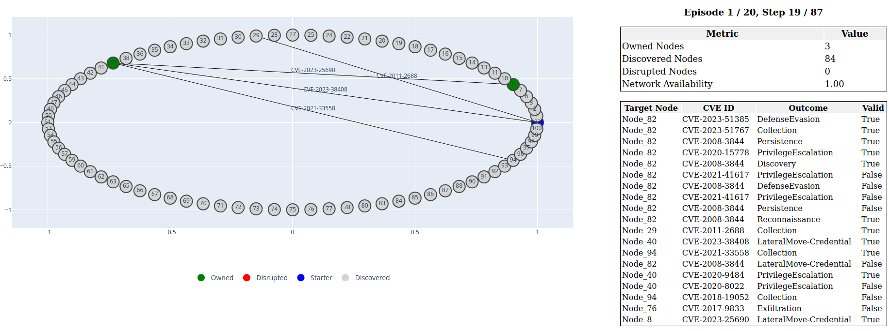

.. _test-agent:

Testing the DRL Agent
===========================

After training, a DRL agent can be evaluated to assess its **performance** and **generalization capabilities** across new or unseen scenarios.
Testing can be conducted on:

- A **test set** automatically split from the original training scenarios based on a complexity metric at scenario generation time.
- A **custom set** of new scenarios defined by the user.

The testing process supports multiple evaluation options, offering insights into agent behavior, action distributions, and performance metrics.
Use the following command to launch a test:

Testing Command
----------------------------

.. code-block:: bash

    cd cyberbattle/agent

    python3 test_agent.py \
        --option {random_agent_performances, actions_distribution, agent_performances, save_trajectories} \
        --logs_folder LOGS_FOLDER_NAME \
        --run_set {RUN_ID, -1 (ALL)} \
        --algorithm ALGORITHM \
        --environment_type {continuous, global, local} \
        [--load_default_test_envs] \
        [--load_custom_test_envs TEST_ENVS_FOLDER] \
        [--val_checkpoints] \
        [--last_checkpoint] \
        [--load_seeds SEEDS_FILE] \
        [--random_seeds]

The ``--option`` flag specifies the type of evaluation to perform:

- ``random_agent_performances``: Test a **random agent** (selects uniformly from valid continuous actions) to use as a baseline.
- ``actions_distribution``: Analyze the **distribution of actions** (e.g., vulnerability IDs, types, outcomes) taken by the agent.
- ``agent_performances``: Evaluate the agent's **task performance**, including the number of owned/discovered/disrupted nodes.
- ``save_trajectories``: Save agent **action trajectories** to CSV files for manual inspection.

Key parameters for the test command:

- ``--logs_folder``: Path to the training log folder containing the agent to test.
- ``--run_set``: Specify a single run ID or use ``-1`` to test **all available runs** and aggregate results.
- ``--load_default_test_envs``: Load predefined **default** test environments.
- ``--load_custom_test_envs``: Load custom test environments from the specified folder.
- ``--val_checkpoints``: Use the **best validation checkpoint** (instead of the final training model).
- ``--last_checkpoint``: Use the **last available checkpoint** during training or validation (depending on ``--val_checkpoints``). If not specified, all checkpoints are assessed.
- ``--load_seeds`` / ``--random_seeds``: Load a predefined list of seeds or generate random ones for reproducibility.

Additional settings (e.g., number of episodes, steps per episode, logging level) are configurable via ``cyberbattle/agent/config/test_config.yaml``.

Testing Output
-----------------------------

A folder containing the statistics generated during the testing process will be created under the logs folder of the training process.
The structure is organized to clearly separate and store metrics from different experiments — including variations by run ID, checkpoint type (training or validation), and test set used — in dedicated subfolders.
Each run's subfolder will include metrics and output files based on the selected evaluation option.

.. code-block:: text

    LOGS_FOLDER
    ├── .....
    ├── test
    │   └── default
    │     └── {train, validation}
    │       └── RUN_ID
    │         └── ......

Agent Visualization
-----------------------------

Equivalent options used for the script ``test_agent.py`` can be used for the script ``visualize_agent.py`` to visualize agent testing behavior in a graphical interface.
A dash application is launched, allowing interactive exploration of the agent's actions and decisions within the environment.

